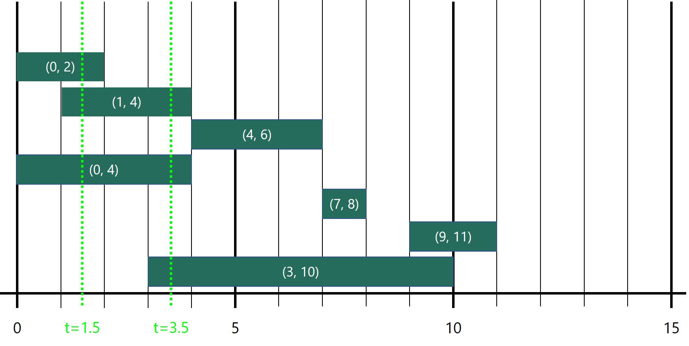
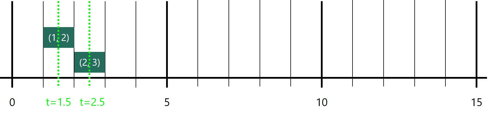
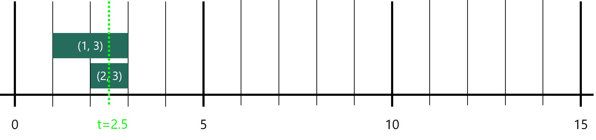
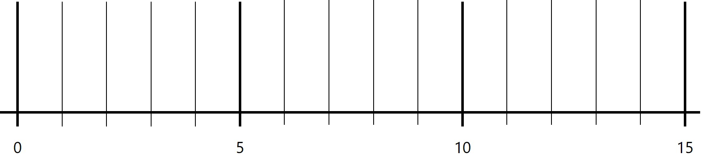

# CC5 - FS21 - Scooter Season

**Due: Tuesday, November 2nd @ 8:00PM ET**

*This is not a team project. Do not copy someone else’s work.*

## Introduction

As an MSU student, you've seen the 
[e-Scooter industry](https://en.wikipedia.org/wiki/Scooter-sharing_system)
explode in front of your eyes: first there was
[Bird](https://www.lansingstatejournal.com/story/news/2018/09/07/electric-scooters-have-landed-east-lansing-bird-ride-share/1223987002/), then there was
[Lime](https://www.lansingstatejournal.com/story/news/2019/09/25/lime-drops-300-e-scooters-lansing-east-lansing-gotcha-msu/2438928001/), then there was
[Gotcha](https://msutoday.msu.edu/news/2019/msu-expands-mobility-research-opportunities-with-e-scooter-partner), and now, there's
[Spin](https://msutoday.msu.edu/news/2021/new-partnership-brings%20e-scooters-back-to-campus).
Inspired by the hot market for [micromobility](https://en.wikipedia.org/wiki/Micromobility)
on a college campus, you've decided to found your own e-scooter company.

In light of recent [supply chain shocks](https://en.wikipedia.org/wiki/2021_global_supply_chain_crisis)
and [chip shortages](https://en.wikipedia.org/wiki/2020%E2%80%932021_global_chip_shortage) inflating prices for your innovative e-scooters—designed
with the help of your friends in the ECE and ME departments—you'd
like to minimize the number of e-scooters you purchase when launching the company.
At the same time, you want to maximize profits and capture market share, so
you don't want to purchase too few! **Ideally, you'll purchase just enough
scooters so that everyone who wants one at a given time _t_ can access one at time _t_,
without purchasing any extras.**

As a CSE 331 student, you recognize this as an optimization problem in which you need to
determine the maximum number of simultaneous resource-users in a provided sequence of
resource-use requests. Recalling what you've learned about min-heaps—namely, their
utility in quickly finding the next-minimum-value in a set of values—you tell
your co-founders from Broad that you know exactly how to use their scooter demand projections
to determine the optimal number of scooters to purchase.

In this coding challenge, you'll be implementing that algorithm with an efficient
*O(nlogn)* and *O(n)* time and space complexity, respectively.

## Challenge

#### Overview

Given an unsorted list of time intervals specifying when an e-scooter is projected to be requested, 
return the minimum number of scooters needed to satisfy demand, such that all users who request
a scooter may access one instantaneously.

More formally, given an unsorted list of *n* tuples of the form *[t_start, t_end)* specifying
the integer start and end times of *n* scooter rentals over the course of a day,
return the minimum number of scooters needed such that all users may access
a scooter immediately at time *t_start*. Note that rental intervals are half-open, 
such that tuples *[t_1, t_2)* and *[t_2, t_3)* are **not** considered to be overlapping.

Abstractly, this amounts to finding the
maximum number of overlapping time intervals *k* in the input list: if the maximum
number of scooters projected to be in use at a single time is *k*, then you must purchase
at minimum *k* scooters to satisfy demand.
Note that if no rentals are projected, *k=0* trivially: no scooters are needed.

Your task is to complete the `scooter_rentals` function with a time complexity of
*O(nlogn)* and space complexity of *O(n)*.

(photo credit: [MSU Innovation Center](https://innovationcenter.msu.edu/corporate-engagement/rd-partnership-highlights/mobility-msu/))

#### Function Signature

`scooter_rentals(times: List[Tuple[int, int]]) -> int:`

#### Input

- An unsorted Python `list` of length *n* containing `tuple[int, int]`s
of the form *[t_start, t_end)*, where *t_start* represents the time at which
a scooter is projected to be in use by a particular user, and *t_end* represents
the time that user is finished with the scooter. Note that rental intervals are half-open, 
such that tuples *[t_1, t_2)* and *[t_2, t_3)* are **not** considered to be overlapping.

#### Output

- An `int` specifying the minimum number of scooters needed to satisfy
demand (assuming half-open rental intervals), 
such that all users may access a scooter immediately.

#### Complexity

- Time: *O(nlogn)*
- Space: *O(n)*

#### Examples

- **Example 1.** Given input `[(0, 2), (1, 4), (4, 6), (0, 4), (7, 8), (9, 11), (3, 10)]`, return 3.
   - At time `t=1.5`, three scooters are needed to satisfy demand: 
   rentals `(0, 2)`, `(1, 4)` and `(0, 4)` will be in use simultaneously. 
   - Likewise, at time `t=3.5`, three scooters are needed to satisfy demand: 
   rentals `(1, 4)`, `(0, 4)` and `(3, 10)` will be in use simultaneously. 
   - Note that the input list is not sorted in any particular manner, and that passing
   any shuffled version of the input list should return the same result.

- **Example 2.** Given input `[(1, 2), (2, 3)]`, return 1.
  - At any given time, only one scooter is needed to satisfy demand.
  - Note that rental intervals are half-open, 
  such that tuples *[t_1, t_2)* and *[t_2, t_3)* are **not** considered to be overlapping. 
  - Note that the input list is not sorted in any particular manner, and that passing
     any shuffled version of the input list should return the same result.
   

- **Example 3.** Given input `[(1, 3), (2, 3)]`, return 2. 
  - At time `t=2.5`, two scooters are needed to satisfy demand: 
     rentals `(1, 3)` and `(2, 3)` will be in use simultaneously. 
  - Note that the input list is not sorted in any particular manner, and that passing
     any shuffled version of the input list should return the same result.
   

- **Example 4.** Given input `[]`, return 0.
  - No scooters are needed to satisfy demand at any time.
   

#### Guarantees

- `0 <= n <= 5000`
- the input `list` is guaranteed to contain only `tuple[int, int]`s if it is not empty
- the first integer in every tuple is guaranteed to be strictly less than the second
- the tuples themselves, however, are **not** guaranteed to be sorted in any way
- the input `list` will never be a `None`-type object and will never contain `None`-types inside

## Submission

#### Deliverables

Be sure to upload the following deliverables in a .zip folder to Mimir by 8:00p 
Eastern Time on Thursday, November 2nd.

Your .zip folder can contain other files (for example, `description.md` and `tests.py`), but must include
(at least) the following:

    CC5.zip
        |— CC5/
            |— README.xml       (for coding challenge feedback)
            |— __init__.py      (for proper Mimir testcase loading)
            |— solution.py      (contains your solution source code)
            
#### Grading

The following 100-point rubric will be used to determine your grade on CC5:

- Tests (70)
    - 00 - Coding Standard: __/5
      - You must complete a properly-formatted docstring to be eligible for these 5 points
    - 01 - Test Trivial: __/10
    - 02 - Test Basic: __/10
    - 03 - Test No Intersections: __/10
    - 04 - Test Intersections: __/10
    - 05 - Test Comprehensive: __/20
    - 99 - Test README.xml Validity: __/5
- Manual (30)
    - M1 - Time Complexity *O(nlogn)*: __/20
    - M2 - Space Complexity *O(n)*: __/10
    - You must pass all automated tests 
(excluding "00 - Coding Standard" and "99 - Test README.xml Validity") to be
eligible for the 30 manual points

## Tips, Tricks & Notes

- We **strongly suggest** using a min-heap to solve this problem!
  - Suppose you iterate over a sorted list of rental request time intervals
  - If the next end time of a scooter currently in-use is
**before** the next rental start time, no additional scooters are needed: the scooter
currently in use may be re-used in the next rental.
  - If, on the other hand, the next end time of a scooter currently in-use is
**after** the next rental start time, an additional scooter will be needed to satisfy demand.
  - Iterating over the sorted list of rental request time intervals costs O(n) time
  - Using a min-heap to store rental end times of scooters currently in-use will cost O(n)
space and O(logn) time to push/pop, but will allow O(1) access to the next rental end time
  - Combine the ideas above to create an O(nlogn) time / O(n) space solution!
- Feel free to build your own min-heap class based on Onsay's lecture notes, or
use the built-in Python `heapq` class
  - Official Python `heapq` [documentation](https://docs.python.org/3/library/heapq.html)
  - GeeksForGeeks `heapq` [article](https://www.geeksforgeeks.org/heap-queue-or-heapq-in-python/)
  - RealPython `heapq` [article](https://realpython.com/python-heapq-module/)
- Remember that *all challenges are opportunities*, in this course and beyond. The journey to your solution is
the true reward, so make the most of it. Enjoy!

Authored by Zach Matson, Adam Kasumovic, Andrew McDonald, and Sebnem Onsay.