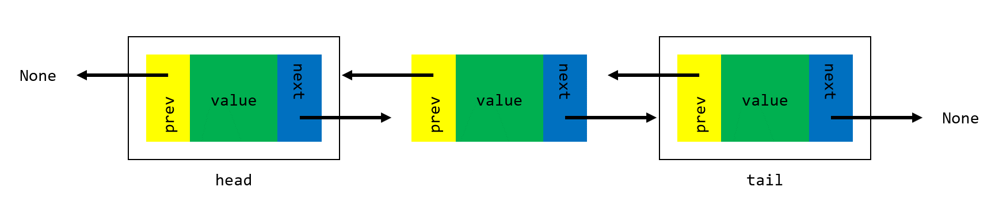
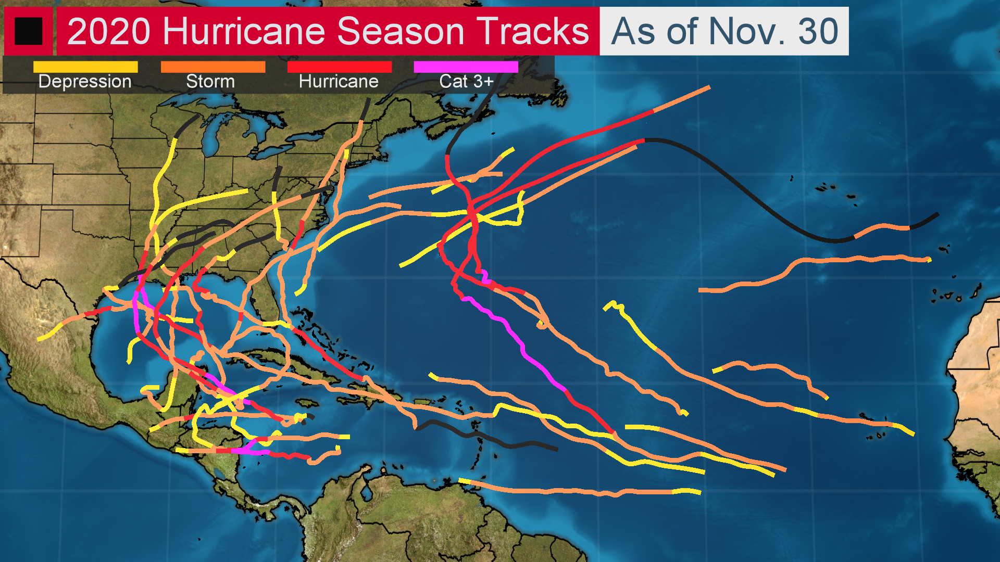
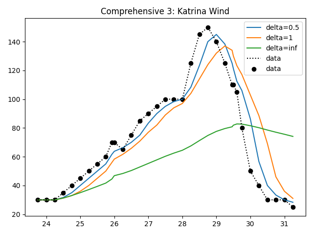
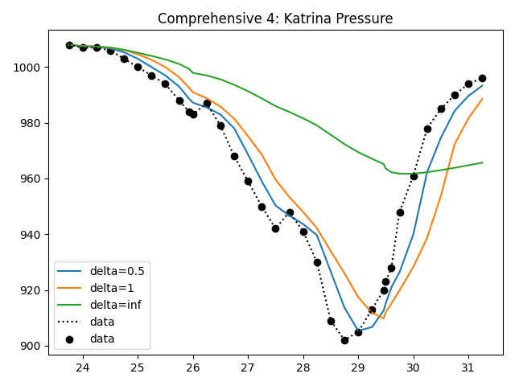

# Project 1: Doubly Linked Lists

**Due: Thursday, October 7th @ 8:00PM ET**

*This is not a team project. Do not copy someone else’s work.*

## Assignment Overview

Doubly linked lists (DLLs) are a fundamental data structure used to store sequential information.
DLLs consist of a chain of *nodes* linked to one another by *forward* and *backward* references,
such that one may traverse the chain from the *head* to the *tail*, or vice-versa. Each node
stores a *value*, which may be a number, string, or more complex object.

Traditional *arrays* provide a simpler means for storing sequential information, but come with
a major drawback which DLLs avoid: arrays require contiguous blocks of memory, while DLLs may utilize
memory wherever it is available. In settings where data is updated, manipulated or deleted frequently,
DLLs outperform traditional arrays by avoiding the need for memory reallocation.
[This article](https://www.geeksforgeeks.org/linked-list-vs-array/) gives a nice overview of the
distinction between DLLs and arrays.

In this project, you will be implementing a DLL from scratch in Python 
and applying it to solve a time-series filtering problem. 

## Assignment Notes

1. Time **and** space complexity account for 30% of the points on Project 1.
Be sure to review the rubric and adhere to complexity requirements!
2. Docstrings (the multi-line comments beneath each function header) are
provided in Project 1 to serve as an example for future reference. 
In future projects, docstrings will **not** be provided,
and will need to be completed for full credit.
3. To evaluate your code's running time, utilize the `test_cProfile` function in the `tests.py` file.
This will be a powerful tool for you to utilize throughout CSE 331 and beyond when runtime is of the essence.
More information is available in the [official Python documentation](https://docs.python.org/3/library/profile.html).
4. Testcases are your friend: before asking about what the form of input/output is or what happens in a
particular edge case, check to see if the testcases answer your question for you. By showing the
expected output in response to each input, they supplement the specs provided here.
5. Don't be afraid to [step through your code in the debugger](https://mediaspace.msu.edu/media/Merge_Sort+Recursive+Work+using+Debugger/1_h0i8pvg2): it will help you figure out where
you're going wrong far more quickly than ad-hoc print statements!
6. Throughout the specs, we mention Python double-underscore "magic" methods. These are central to the
structure of object-oriented programming in Python, and will continue to appear in future projects in CSE 331 and beyond.
[This page](https://rszalski.github.io/magicmethods/) is a great reference if you'd like to learn more about how they work!
7. We **strongly** encourage you to avoid calling `delete` in `delete_all`. Why? It's
far less efficient to repeatedly call `delete`, as each call to `delete` begins searching
at the beginning of the list. In the worst case, this will lead our function to operate
with O(n^2) time complexity, **violating the required time complexity.**
8. We **strongly** encourage you to implement `reverse` in-place, without creating any
new `Node` objects and instead rearranging `prev` and `next` pointers. Why?
It's far less efficient to rebuild the DLL than it is to simply adjust references, as it's
far more work to construct a brand new `Node` object than it is to simply 
adjust an existing one's references.
9. In the testcases for this project, you will notice the use of `assertEqual` and `assertIs`.
What's the difference? It ties back to the difference between `==` and `is` in Python.
The double-equal sign compares *values* in Python, while the `is` operator compares *memory addresses*
in Python. Put simply, the `is` keyword is stronger than `==`: if two objects are at the
same memory address, they must contain the same value. However, it is possible for two
objects *not* at the same memory address to have the same value. In other words,
if `a is b` then we know `a == b` as well, but if `a == b` we cannot conclude `a is b`.
A great read on the subject is [available here](https://realpython.com/courses/python-is-identity-vs-equality/).

## Assignment Specifications

#### class Node:

*DO NOT MODIFY the following attributes/functions*

- **Attributes**
  - **value: T:** Value held by the `Node`. Note that this may be any type, such as a `str`, `int`,
  `float`, `dict`, or a more complex object.
  - **next: Node:** Reference to the next `Node` in the linked list (may be `None`).
  - **prev: Node:** Reference to the previous `Node` in the linked list (may be `None`).
- **\_\_init\_\_(self, value: T, next: Node = None, prev: Node = None) -> None**
  - Constructs a doubly linked list node.
  - **value: T:** Value held by the `Node`.
  - **next: Node:** Reference to the next `Node` in the linked list (may be `None`).
  - **prev: Node:** Reference to the previous `Node` in the linked list (may be `None`).
  - **Returns:** `None`.
- **\_\_str\_\_(self) -> str** and **\_\_repr\_\_(self) -> str**
  - Represents the `Node` as a string.
  - Note that Python will automatically invoke this function when using printing a `Node`
    to the console, and PyCharm will automatically invoke this function when displaying a
    `Node` in the debugger.
  - As with all double-underscore "magic" methods in Python (see note 5), this function may be called
    with `str(node)` or `repr(node)`. It is not necessary (and stylistically improper)
    to use `node.__str__()` or `node.__repr__()`, just as it is preferable to
    call `len(some_list)` instead of `some_list.__len__()`.
  - **Returns:** `str`.

#### class DLL:

*DO NOT MODIFY the following attributes/functions*

- **Attributes**
  - **head: Node:** Head (first node) of the doubly linked list (may be `None`).
  - **tail: Node:** Tail (last node) of the doubly linked list (may be `None`).
  - **size: int:** Number of nodes in the doubly linked list.
  - Note that the implementation in this project does not use a [sentinel node](https://en.wikipedia.org/wiki/Sentinel_node).
  As such, an empty `DLL` will have `head` and `tail` attributes which are `None`.
- **\_\_init\_\_(self) -> None**
  - Construct an empty DLL. Initialize the head and tail to `None`, and set the size to zero.
  - **Returns:** `None`.
- **\_\_str\_\_(self) -> str** and **\_\_repr\_\_(self) -> str**
  - Represents the `DLL` as a string of the form "value <-> value <-> ... <-> value."
  - Note that Python will automatically invoke this function when using printing a `DLL`
  to the console, and PyCharm will automatically invoke this function when displaying a
  `DLL` in the debugger.
  - As with all double-underscore "magic" methods in Python (see note 5), this function may be called
    with `str(dll)` or `repr(dll)`. It is not necessary (and stylistically improper)
    to use `dll.__str__()` or `dll.__repr__()`, just as it is preferable to
    call `len(some_list)` instead of `some_list.__len__()`.
  - **Returns:** `str`.
  
*IMPLEMENT the following functions*

- **empty(self) -> bool**
  - Returns a boolean indicating whether the `DLL` is empty.
  - *Required time complexity:* O(1).
  - *Required space complexity:* O(1).
  - **Returns:** `True` if `DLL` is empty, else `False`.
- **push(self, val: T, back: bool = True) -> None**
  - Adds a `Node` containing `val` to the back (or front) of the `DLL` and updates size accordingly.
  - *Required time complexity:* O(1).
  - *Required space complexity:* O(1).
  - **val: T:** Value to be added to the `DLL`.
  - **back: bool:** If `True`, add `val` to the back of the `DLL`. If `False`, add to the front.
    Note that the default value is `True`.
  - **Returns:** `None`.
- **pop(self, back: bool = True) -> None**
  - Removes a `Node` from the back (or front) of the `DLL` and updates size accordingly.
  - In the case that the `DLL` is empty, `pop` does nothing.
  - *Required time complexity:* O(1).
  - *Required space complexity:* O(1).
  - **back: bool:** If `True`, remove from the back of the `DLL`. If `False`, remove from the front.
    Note that the default value is `True`.
  - **Returns:** `None`.
- **from_list(self, source: list\[T\]) -> None**
  - Creates a `DLL` from a standard Python list.
  - *Required time complexity:* O(n).
  - *Required space complexity:* O(n).
  - **source: list\[T\]:** Standard Python list from which to construct DLL.
  - **Returns:** `None`.
- **to_list(self) -> list\[T\]**
  - Creates a standard Python list from a `DLL`.
  - *Required time complexity:* O(n).
  - *Required space complexity:* O(n).
  - **Returns:** `list[T]` containing the values of the nodes in the `DLL`.
- **find(self, val: T) -> Node**
  - Finds first `Node` with value `val` in the DLL and returns the associated `Node` object.
  - *Required time complexity:* O(n).
  - *Required space complexity:* O(1).
  - **val: T:** Value to be found in the DLL.
  - **Returns:** first `Node` object in the `DLL` whose value is `val`. If `val` does not exist in the DLL,
  returns `None`.
- **find_all(self, val: T) -> list\[Node\]**
  - Finds all `Node` objects with value `val` in the DLL and returns a standard Python list
    of the associated `Node` objects.
  - *Required time complexity:* O(n).
  - *Required space complexity:* O(n).
  - **val: T:** Value to be found in the DLL.
  - **Returns:** standard Python list of all `Node` objects in the `DLL` whose value is `val`. 
    If `val` does not exist in the DLL, returns an empty list.
- **_remove_node(self, to_remove: Node) -> None**
  - Given a reference to a node in the linked list, remove it
  - MUST BE CALLED FROM `delete` AND `delete_all`
  - Will not be tested explicitly
    - Tests for `delete` and `delete_all` will ensure functionality
  - *Required time complexity:* O(1).
  - *Required space complexity:* O(1).
  - **to_remove: Node:** Node to be deleted from the DLL.
  - **Returns:** None.
- **delete(self, val: T) -> bool**
  - Deletes first `Node` with value `val` in the DLL.
  - MUST CALL `_remove_node`
    - Idea: find reference to node object to be removed, then call `_remove_node`
  - *Required time complexity:* O(n).
  - *Required space complexity:* O(1).
  - **val: T:** Value to be deleted from the DLL.
  - **Returns:** `True` if a `Node` with value `val` was found and deleted from the DLL, else `False`.
- **delete_all(self, val: T) -> int**
  - Deletes all `Node` objects with value `val` in the DLL. See note 6.
  - MUST CALL `_remove_node`
    - Idea: find reference to all node objects to be removed, then call `_remove_node` multiple times
  - *Required time complexity:* O(n).
  - *Required space complexity:* O(n).
  - **val: T:** Value to be deleted from the DLL.
  - **Returns:** number of `Node` objects with value `val` deleted from the DLL. If no node
  containing `val` exists in the DLL, returns 0.
- **reverse(self) -> None**
  - Reverses the DLL in-place by modifying all `next` and `prev`
    references of `Node` objects in DLL. Updates `self.head` and `self.tail` accordingly. See note 7.
  - *Required time complexity:* O(n).
  - *Required space complexity:* O(1).
  - **Returns:** `None`.

## Application: Flurricane

As a hurricane hunter with the [National Hurricane Center](https://www.nhc.noaa.gov/), you've been busy the last few years.
In 2020, you chased 30 named storms in what would become the 
[most active hurricane season](https://en.wikipedia.org/wiki/2020_Atlantic_hurricane_season)
of all time. In 2021, you've been sent to 
Florida for [Hurricane Elsa's](https://en.wikipedia.org/wiki/Hurricane_Elsa) landfall,
Rhode Island for [Hurricane Henri's](https://en.wikipedia.org/wiki/Hurricane_Henri) landfall,
Louisiana for [Hurricane Ida's](https://en.wikipedia.org/wiki/Hurricane_Ida) landfall, and most recently,
Texas for [Hurricane Nicholas'](https://en.wikipedia.org/wiki/Hurricane_Nicholas) landfall.
You're exhausted!

Nevertheless, you know you've got a busy October and November ahead of you, and decide it's worth investing
some time to improve your forecasting skills. Annoyed that the wind speed and atmospheric pressure time-series data 
you analyze is [noisy](https://en.wikipedia.org/wiki/Noise_(electronics)) (filled with random fluctuations obscuring meaningful signal) 
you decide to apply the skills you learned back in CSE 331 to implement a [filtering](https://en.wikipedia.org/wiki/Filter_(signal_processing)) algorithm: `flurricane`.
Ultimately, the output of `flurricane` will allow you to more easily determine whether a storm is intensifying or weakening.

The wind speed and atmospheric pressure time-series data you're working with is stored in linked lists, 
as the National Hurricane Center aggregates data from multiple sources 
(e.g., aircraft measurements, satellite-derived imagery, and ground-level sensors)
and needs O(1) insertion to efficiently merge observations from each distinct data source. 
[Reallocating new contiguous blocks of memory when merging observations
would be highly inefficient](https://www.geeksforgeeks.org/linked-list-vs-array/). Thus, `flurricane`
will take in a single, pre-merged, noisy linked list of time-series data as input, 
and return a single filtered linked list of time-series data as output.

In more formal terms, `flurricane` will accept as input a `DLL` holding `Tuple(float, float)`
in the `.value` attribute of each `Node`. Each `Tuple(float, float)` represents the pair `(t, x)`, where
`t` is the time of a measurement `x`. In the applications we consider, `x` will either represent
the maximum sustained wind speed of a hurricane at time `t`, or the minimum atmospheric pressure of a
hurricane at time `t`. Also provided as input to `flurricane` is `delta`, a `float` representing the
length of time we wish to average over when filtering.

The output of `flurricane` will be a `DLL` holding `Tuple(float, float)`
in the `.value` attribute of each `Node`, with tuples representing pairs `(t, filtered_x)`.
The time `t` in each tuple will be the exact same as the `t` in each tuple of the input DLL, and
the `filtered_x` in each tuple is computed as the simple average of all `x` observed
in the input list from `t-delta` until `t` (including endpoints).

In other words, `flurricane` will implement a simple [moving average filter](https://en.wikipedia.org/wiki/Moving_average) on time-series data. 
See the plots below to gain an intuition for the effect of our filter applied to time-series wind and pressure data from [Hurricane Katrina](https://en.wikipedia.org/wiki/Hurricane_Katrina),
and note that you can generate these plots yourself by setting `show_plots = True`
in `test_filter_comprehensive`.

Let's summarize:

- **flurricane(dll: DLL, delta: float) -> DLL**
  - Applies a moving average filter of width `delta` (including endpoints) to the time-series data in `dll`.
  - *Required time complexity:* O(n).
  - *Required space complexity:* O(n).
  - **dll: DLL:** A DLL where each `Node` holds a `value` of `Tuple(float, float)` representing the pair `(t, x)`
  where `t` represents the time of some measurement `x`.
  - **delta: float:** Width of the moving average filter to apply.
  - **Returns:** a `DLL` holding `Tuple(float, float)` representing `(t, filtered_x)`,
  where `t` corresponds exactly to the `t` in the input list, and `filtered_x` is the average of all observations
  `x` recorded from `t-delta` to `t` (including endpoints).
  - Notes:
    - If the DLL is empty, return an empty DLL.
    - Nodes in the DLL will always be in chronological order, with the `t` value
    in each pair `(t, x)` monotonically increasing.
    - We suggest you approach the problem with a [sliding window](https://stackoverflow.com/questions/8269916/what-is-sliding-window-algorithm-examples)
    technique, moving `left` and `right` node references across the DLL. In particular, we suggest
    you run this sliding window from the `tail` of the DLL towards the `head`, working in reverse.
    While the time at the `left` node reference is within `delta` of the time at the `right` node
    reference, you can move the `left` reference to the left, increasing the width of the window.
    Once the window encompasses the proper set of values between `t-delta` to `t` (including endpoints),
    compute the window average. Then, move the `right` node reference to the left, and continue.
    
#### Example 1

- **Input:** A `DLL` containing `[(0, 0), (1, 1), (2, 2), (3, 3)]` and `delta=1`.
- **Output:** A `DLL` containing `[(0, 0), (1, 0.5), (2, 1.5), (3, 2.5)]`.
- **Explanation:** 
  - The only `(t,x)` pair within the time interval `[t-delta, t] = [-1, 0]`
  defined by `t=0` is `(0, 0)`, so this defines the trivial `filtered_x=0` at `t=0`.
  - At `t=1`, both `(0, 0)`  and `(1, 1)` are within `[t-delta, t] = [0, 1]`, hence `filtered_x=0.5`
  as the average of 0 and 1. 
  - At `t=2`, both `(1, 1)`  and `(2, 2)` are within `[t-delta, t] = [1, 2]`, hence `filtered_x=1.5`.
  - At `t=3`, both `(2, 2)`  and `(3, 3)` are within `[t-delta, t] = [2, 3]`, hence `filtered_x=2.5`.
  - Compiling the pairs `(t, filtered_x)` into a `DLL` gives us the desired result.    
  

#### Example 2

- **Input:** A `DLL` containing `[(0, 0), (1, 1), (5, 2), (6, 3)]` and `delta=1`.
- **Output:** A `DLL` containing `[(0, 0), (1, 0.5), (5, 2), (6, 2.5)]`.
- **Explanation:** 
  - The only `(t,x)` pair within the time interval `[t-delta, t] = [-1, 0]`
  defined by `t=0` is `(0, 0)`, so this defines the trivial `filtered_x=0` at `t=0`.
  - At `t=1`, both `(0, 0)`  and `(1, 1)` are within `[t-delta, t] = [0, 1]`, hence `filtered_x=0.5`
  as the average of 0 and 1. 
  - At `t=5`, only  `(5, 2)` is within `[t-delta, t] = [4, 5]`, hence `filtered_x=2`.
  - At `t=6`, both `(5, 2)` and `(6, 2.5)` are within `[t-delta, t] = [5, 6]`, hence `filtered_x=2.5`.
  - Compiling the pairs `(t, filtered_x)` into a `DLL` gives us the desired result.

## Submission

#### Deliverables

Be sure to upload the following deliverables in a .zip folder to Mimir by 8:00p ET on Thursday, October 7th.

    Project1.zip
        |— Project1/
            |— README.xml      (for project feedback)
            |— __init__.py     (for proper Mimir testcase loading)
            |— DLL.py          (contains your solution source code)

#### Grading

- Tests (70)
  - Point distribution is specified in Mimir testcases
- Manual (30)
  - Time and space complexity points are **all-or-nothing** for each function.
  If you fail to meet time **or** space complexity in a given function,
  you do not receive manual points for that function.
  - `empty`: \_\_ / 2
  - `push`: \_\_ / 2
  - `pop`: \_\_ / 2
  - `from_list`: \_\_ / 2
  - `to_list`: \_\_ / 2
  - `find`: \_\_ / 2
  - `find_all`: \_\_ / 2
  - `_remove_node`: \_\_ / 2
    - If `delete` and `delete_all` do not call `_remove_node`, **all testcase and manual points**
    for `delete` and `delete_all` will be forfeited.
    - If `_remove_node` violates time and/or space complexity and is called by `delete`
    and `delete_all` (as it must be), **all manual points** will be forfeited for the three functions.
    
  - `delete`: \_\_ / 2
  - `delete_all`: \_\_ / 2
  - `reverse`: \_\_ / 2
  - `flurricane`: \_\_ / 8
      
## Appendix

#### Authors

Project authored by Andrew McDonald, Alexander Woodring and Andrew Haas

#### Meme

When in doubt, pivot it out, Spartans.

